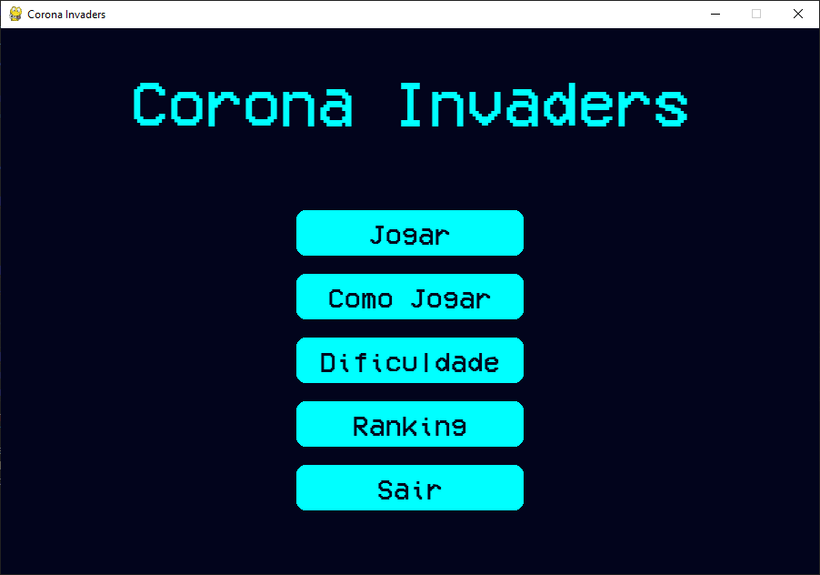
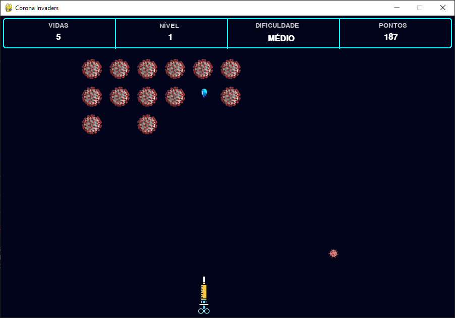
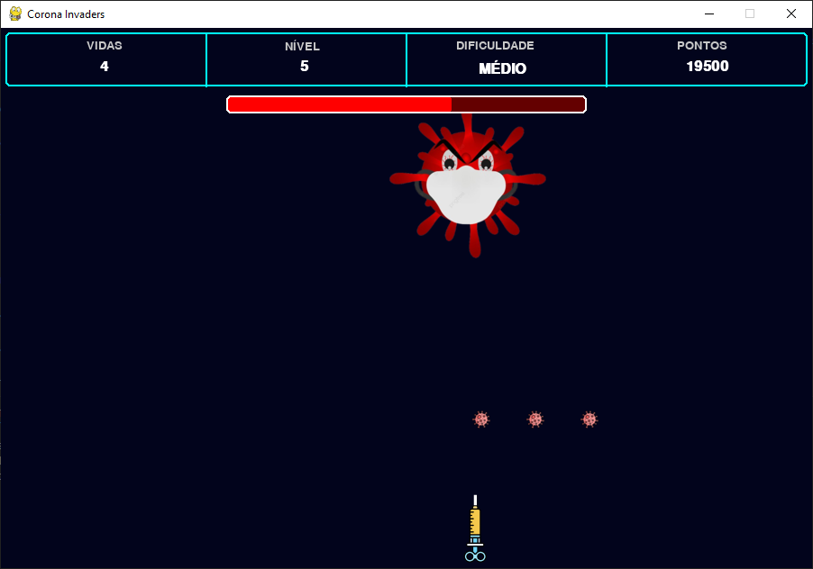

# 👾 Corona Invaders

| Tela Inicial | Partida em Andamento | Batalha de Chefe |
|:---:|:---:|:---:|
|  |  |  |

Um jogo de tiro espacial no estilo clássico, onde você comanda a última nave de defesa da galáxia contra hordas crescentes de perigosos invasores virais. Sobreviva, use power-ups e enfrente chefões para registrar a maior pontuação!

---

## ✨ Funcionalidades

* **Jogabilidade Clássica:** Enfrente ondas de inimigos que se movem e atacam em formação, em um desafio de sobrevivência e pontuação.
* **Níveis Progressivos:** A dificuldade aumenta a cada nível, com inimigos mais rápidos e em maior número.
* **Batalhas de Chefe:** A cada 5 níveis, um poderoso **Chefão** surge com padrões de ataque complexos e múltiplos pontos de vida.
* **Dificuldade Ajustável:** Escolha entre os modos **Fácil, Médio e Difícil**, que alteram vidas do jogador, velocidade dos inimigos e muito mais.
* **Power-Ups:** Colete power-ups que caem dos inimigos para ganhar vantagens, como **Escudo de Proteção (🛡️)** e **Tiro Rápido (⚡)**.
* **Sistema de Ranking:** Suas pontuações são salvas! Uma tela de ranking persistente exibe os melhores jogadores.
* **"Game Juice" e Efeitos Visuais:**
    * **Screen Shake:** A tela treme a cada dano sofrido, aumentando o impacto e a imersão.
    * **Animações de Explosão:** Efeitos visuais para a destruição de inimigos e do jogador.
* **Interface Gráfica Completa:** Menus bem desenhados, tela de "Como Jogar", seleção de dificuldade, menu de pausa funcional e tela de "Game Over" para inserção de nome.
* **Efeitos Sonoros:** Música de fundo e efeitos sonoros para tiros, explosões e danos, criando uma atmosfera envolvente.

---

## 🔧 Tecnologias Utilizadas

* **Linguagem:** Python 3.11
* **Bibliotecas Principais:**
    * [Pygame](https://www.pygame.org/) - A base para toda a lógica de jogo, renderização e gerenciamento de eventos.
    * [PPlay Game Engine](http://www2.ic.uff.br/pplay/) - Uma biblioteca wrapper sobre o Pygame para facilitar a manipulação de sprites, animações, som e janelas.

---

## 🚀 Como Executar o Projeto

Siga os passos abaixo para rodar o Corona Invaders na sua máquina local.

### Pré-requisitos

* Python 3.8 ou superior instalado.
* `pip` (gerenciador de pacotes do Python).

### Instalação

1.  **Clone o repositório:**
    ```sh
    git clone https://github.com/MateusFerreiraM/Corona_Invaders.git
    cd Corona_Invaders
    ```

2.  **Crie um Ambiente Virtual (Recomendado):**
    ```sh
    python -m venv venv
    ```
    Ative o ambiente:
    * No Windows: `.\venv\Scripts\activate`
    * No macOS/Linux: `source venv/bin/activate`

3.  **Instale as dependências:**
    ```sh
    pip install -r requirements.txt
    ```

4.  **Execute o Jogo:**
    ```sh
    python main.py
    ```

---

## 🎮 Como Jogar

* **Objetivo:** Sobreviver o máximo de tempo possível, destruir os inimigos e chefões para alcançar a maior pontuação.
* **Controles:**
    * **Mover a Nave:** `Seta para Esquerda` / `Seta para Direita` ou `A` / `D`.
    * **Atirar:** `Barra de Espaço`.
    * **Pausar:** `ESC` durante a partida para abrir o menu de pause.

---

## 📂 Estrutura de Arquivos
```
.
├── assets/
│   ├── font/
│   ├── images/
│   └── sounds/
├── asset_manager.py
├── constants.py
├── entities.py
├── main.py
├── scenes.py
├── requirements.txt
└── README.md
```

## 📄 Licença

Este projeto está sob a licença MIT.
